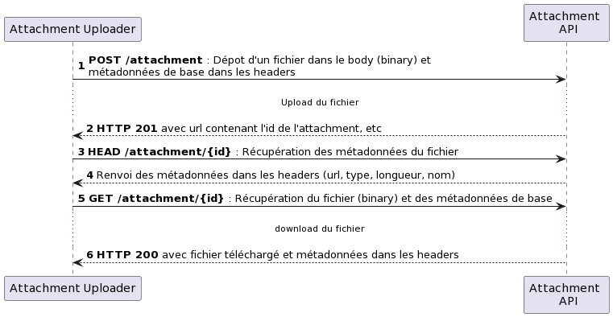

#API d'upload de pièce jointe

Cette API décrit, de façon très simpliste, un moyen d'échanger des fichiers entre deux opérateurs (quelque soit leur type)
et de référencer ces fichiers dans d'autres API via des "liens".

Cet API permet :
- De déposer un fichier
- De récupérer les métadonnées
- De récupérer le fichier ainsi que ses métadonnées



## Dépot d'un fichier

### Requête

Envoi des headers : 
- Content-Length : Taille de la pièce jointe à déposer
- Content-Disposition : Permet de renseigner le nom de la pièce jointe dans le bloc ```filename=```
- Content-Type : Le type mime du fichier

Envoi du contenu de la pj dans le body de la requête, en binary, sans base64encode

```bash
curl --location --request POST 'https://serverRoot/attachment/v1/attachment' \
--header 'Content-Length: 66693374' \
--header 'Content-Disposition: attachment; filename="mySuperJpg.jpg"' \
--header 'Content-Type: image/jpeg' \
--data-binary '@'
```

### Réponse

Récupération des headers suivants : 

- Content-Length : Taille de la pièce jointe
- Content-Type : Le type mime du fichier
- Content-Disposition : Renvoie le nom de la pièce jointe dans le bloc ```filename=```
- Content-Location : Renvoie l'url d'accès à la pièce jointe, ainsi que son id (à référencer dans les APIs utilisant les attachments 
  (i.e ```/attachment/72db2628-73ac-11ec-90d6-0242ac120003``` où ```72db2628-73ac-11ec-90d6-0242ac120003``` est l'identifiant de la pj)

## Récupération des métadonnées du fichier

### Requête

```bash
curl --location --head 'https://serverRoot/attachment/v1/attachment/72db2628-73ac-11ec-90d6-0242ac120003'
```
---
**NOTE**

Pas de header ou de body. Seul l'id dans la requête permet d'identifier la pj

---

### Réponse

Récupération des headers suivants :

- Content-Length : Taille de la pièce jointe
- Content-Type : Le type mime du fichier
- Content-Disposition : Renvoie le nom de la pièce jointe dans le bloc ```filename=```
- Content-Location : Renvoie l'url d'accès à la pièce jointe, ainsi que son id (à référencer dans les APIs utilisant les attachments
  (i.e ```/attachment/72db2628-73ac-11ec-90d6-0242ac120003``` où ```72db2628-73ac-11ec-90d6-0242ac120003``` est l'identifiant de la pj)

## Récupération du fichier déposé

### Requête

```bash
curl --location --request GET 'https://serverRoot/attachment/v1/attachment/72db2628-73ac-11ec-90d6-0242ac120003'
```
---
**NOTE**

Pas de header ou de body. Seul l'id dans la requête permet d'identifier la pj

---

### Réponse

Récupération des headers suivants :

- Content-Length : Taille de la pièce jointe
- Content-Type : Le type mime du fichier
- Content-Disposition : Renvoie le nom de la pièce jointe dans le bloc ```filename=```
- Content-Location : Renvoie l'url d'accès à la pièce jointe, ainsi que son id (à référencer dans les APIs utilisant les attachments
  (i.e ```/attachment/72db2628-73ac-11ec-90d6-0242ac120003``` où ```72db2628-73ac-11ec-90d6-0242ac120003``` est l'identifiant de la pj)

Le body contient le contenu binaire de l'attachment.
